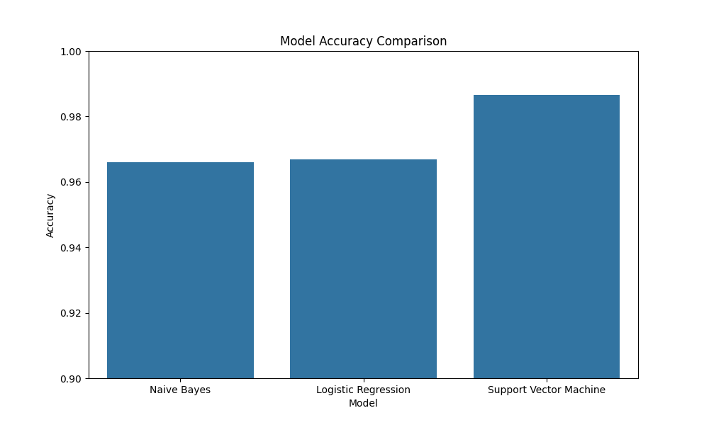

# Spam SMS Detection Report

## 1. Introduction

This report presents the development and evaluation of machine learning models for classifying SMS messages as spam or legitimate (ham). The task involves using natural language processing techniques and machine learning algorithms to automatically identify unwanted or fraudulent messages.

## 2. Dataset Analysis

The dataset consists of 5,572 SMS messages labeled as either "spam" or "ham" (legitimate). Here's a summary of the dataset:

- **Total messages**: 5,572
- **Ham messages**: 4,825 (86.59%)
- **Spam messages**: 747 (13.41%)

### 2.1 Message Length Analysis

We analyzed the length of messages in both categories:

| Category | Count | Mean Length | Std Dev | Min | 25% | 50% | 75% | Max |
|----------|-------|-------------|---------|-----|-----|-----|-----|-----|
| Ham      | 4,825 | 71.02       | 58.02   | 2   | 33  | 52  | 92  | 910 |
| Spam     | 747   | 138.87      | 29.18   | 13  | 132.5 | 149 | 157 | 224 |

This analysis reveals that spam messages tend to be significantly longer than legitimate messages, with less variation in length. This is likely because spam messages often contain promotional content, offers, and instructions that require more text.

## 3. Methodology

### 3.1 Text Preprocessing

We applied the following preprocessing steps to the SMS messages:

1. **Lowercase conversion**: Converting all text to lowercase to ensure consistency
2. **Punctuation removal**: Removing all punctuation marks
3. **Stopword removal**: Eliminating common English words that don't carry significant meaning
4. **Number removal**: Removing numerical digits

### 3.2 Feature Extraction

We used the **Term Frequency-Inverse Document Frequency (TF-IDF)** vectorization technique to convert the text messages into numerical features. TF-IDF helps to:

- Highlight words that are important in a message
- Reduce the importance of words that appear frequently across all messages
- Create a numerical representation of text that machine learning algorithms can process

### 3.3 Model Selection

We implemented and evaluated three different machine learning algorithms:

1. **Naive Bayes**: A probabilistic classifier based on Bayes' theorem, commonly used for text classification
2. **Logistic Regression**: A linear model for binary classification
3. **Support Vector Machine**: A powerful classifier that finds the optimal hyperplane to separate classes

### 3.4 Evaluation Metrics

We used the following metrics to evaluate model performance:

- **Accuracy**: The proportion of correctly classified messages
- **Precision**: The proportion of true spam messages among those classified as spam
- **Recall**: The proportion of actual spam messages that were correctly identified
- **F1-score**: The harmonic mean of precision and recall

## 4. Results

### 4.1 Model Performance Comparison

| Model | Accuracy | Precision (Spam) | Recall (Spam) | F1-Score (Spam) |
|-------|----------|------------------|---------------|-----------------|
| Naive Bayes | 96.59% | 0.99 | 0.75 | 0.85 |
| Logistic Regression | 96.68% | 0.98 | 0.77 | 0.86 |
| Support Vector Machine | 98.65% | 0.99 | 0.91 | 0.95 |

### 4.2 Confusion Matrices

#### Naive Bayes

#### Logistic Regression

#### Support Vector Machine

### 4.3 Analysis of Results

- **Support Vector Machine** achieved the highest overall accuracy (98.65%) and the best balance between precision and recall for spam detection.
- **Naive Bayes** and **Logistic Regression** performed similarly, with accuracies of 96.59% and 96.68% respectively.
- All models achieved high precision for spam detection (0.98-0.99), meaning that when they classify a message as spam, they are rarely wrong.
- The main difference between models is in recall (ability to find all spam messages):
  - SVM: 0.91 recall
  - Logistic Regression: 0.77 recall
  - Naive Bayes: 0.75 recall

This indicates that the SVM model is significantly better at identifying spam messages without missing them, which is crucial for effective spam filtering.

## 5. Example Predictions

To demonstrate the practical application of our best model (Support Vector Machine), we tested it on some example messages:

1. "Congratulations! You've won a $1000 gift card. Call now to claim your prize!" → **Spam**
2. "Hey, what time are we meeting for dinner tonight?" → **Ham**
3. "URGENT: Your bank account has been suspended. Click here to verify your information." → **Spam**
4. "Don't forget to pick up milk on your way home." → **Ham**
5. "Free entry to the biggest show in town! Limited tickets available. Reply YES to claim yours now!" → **Spam**

These predictions align with our expectations and demonstrate the model's ability to correctly classify both obvious and subtle spam messages.

## 6. Conclusion

Our analysis shows that machine learning models, particularly Support Vector Machines with TF-IDF vectorization, can effectively classify SMS messages as spam or legitimate with high accuracy. The SVM model achieved an impressive 98.65% accuracy and demonstrated strong performance across all evaluation metrics.

Key findings from this project:

1. Spam messages tend to be longer than legitimate messages
2. TF-IDF vectorization effectively captures the distinguishing features of spam messages
3. Support Vector Machines outperform Naive Bayes and Logistic Regression for this task
4. The model achieves high precision, ensuring minimal false positives (legitimate messages classified as spam)
5. With 91% recall for spam detection, the SVM model successfully identifies the vast majority of unwanted messages

This spam detection system could be deployed in mobile applications or messaging platforms to automatically filter unwanted messages, improving user experience and security.

## 7. Future Improvements

Potential enhancements to the current system:

1. **Advanced feature engineering**: Incorporate additional features like message sentiment, presence of URLs, or specific spam-related keywords
2. **Word embeddings**: Experiment with word2vec or GloVe embeddings to capture semantic relationships between words
3. **Deep learning models**: Implement LSTM or transformer-based models for potentially higher accuracy
4. **Ensemble methods**: Combine multiple models to improve overall performance
5. **Regular retraining**: Implement a system to periodically retrain the model with new spam examples to adapt to evolving spam techniques